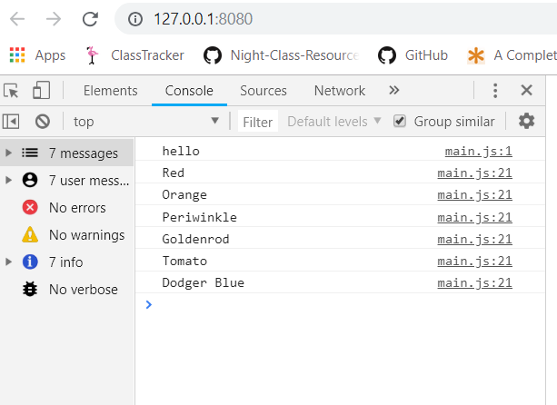

# Debugging Intro

This exercise was to teach us about developer tools more extensively. By using the dev tools, we were able to find issues easier compared to just reading the code. We were taught how to use breakpoints, using the console and sources and much more. 



# How to run this project

1. Use npm to install http-server in your terminal if you have not already:
```
npm install -g http-server
```

2. Run the server: 
```
hs -p 9999
```
3. Open Chrome and navigate to:
```
localhost:9999
```